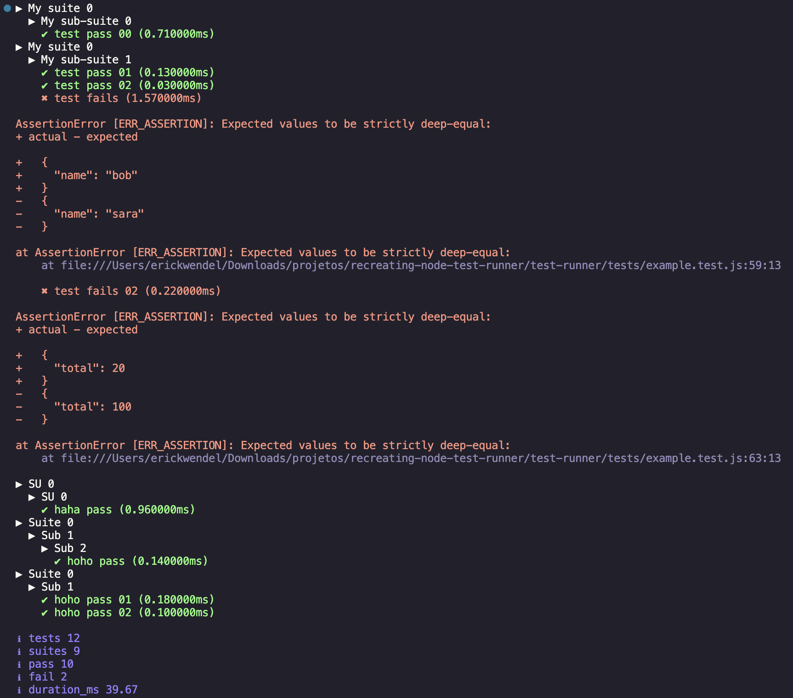

# Node.js Custom Test Runner Experiment

[](https://github.com/ErickWendel/recreating-nodejs-test-runner/actions)


## Introduction

This project is an experiment where I recreate the Node.js test runner using the same components. The primary goal is to understand and demonstrate the functionality of the test runner using:

- Parallelism with Child Processes
- AsyncHooks and Async LocalStorage for tracking the origin and retrieving the entire tree of tests.
- Testing API with hooks such as `describe`, `it`, `before`, `after`, `beforeEach`, `afterEach`

## Project Structure

- **[app](./app/)**: Contains a complete project which is an API with a comprehensive test suite. This suite tests each individual route and uses the custom test runner to prove the experiment's functionality.

## Test Runner Components

This custom test runner follows all the steps a test runner needs to have:

- **Executor**: Located at [./test-runner/bin/test-runner.js](./test-runner/bin/test-runner.js)
- **Formatter**: Located at [./test-runner/bin/reporter.js](./test-runner/bin/reporter.js)
- **JS API for Hooks**: Located at [./test-runner/module/testRunner.js](./test-runner/module/testRunner.js)

### Role of AsyncHooks

`AsyncHooks` are crucial for this project as they allow tracking the origin and retrieving the entire tree of tests. This helps in understanding which `describe` block all hooks belong to. Using `AsyncHooks`, the context of asynchronous operations is maintained, ensuring that hooks like `before`, `after`, `beforeEach`, and `afterEach` are correctly associated with their respective test cases.

## Getting Started

### Prerequisites

Ensure you have the following installed:

- Node.js (>=20.14)
- Docker and docker-compose (for executing [./app](./app/))

### Installation

```sh
git clone https://github.com/ErickWendel/recreating-nodejs-test-runner.git
```

## Complete app
```sh
cd recreating-nodejs-test-runner/app
docker-compose up -d
npm test
```


## Test runner Example

Clone the repository and install the dependencies:

```sh
cd recreating-nodejs-test-runner/test-runner
npm test
```



### Running the Tests

To run the tests using the custom test runner, use the following command:

```sh
npm test
```

## Example Outputs

### Test Runner Output

Below is an example output of the test runner:

```sh
$ npm test

> recreating-nodejs-test-runner@1.0.0 test
> node test-runner.js

✔️  Test Suite: User API
   ✔️  should create a new user
   ✔️  should get a user by ID
   ✔️  should update a user
   ✔️  should delete a user
```

### App Output

Below is an example output of the app's test suite using the custom test runner:

```sh
$ npm test

> recreating-nodejs-test-runner@1.0.0 test
> node app/test-runner.js

✔️  Test Suite: User API
   ✔️  should create a new user
   ✔️  should get a user by ID
   ✔️  should update a user
   ✔️  should delete a user

All tests passed!
```

## Contributing

Contributions are welcome! Please open an issue or submit a pull request for any changes or improvements.

## License

This project is licensed under the MIT License.

---
## Todo

- add feature so before and beforeEach executes inside sub suites
- fix log
